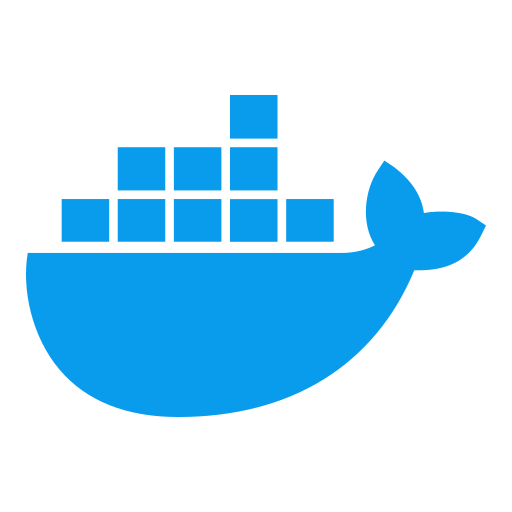

  

<h1 align="center">𝑬𝒙𝒑𝒆𝒓𝒕 𝐅𝐮𝐥𝐥-𝐒𝐭𝐚𝐜𝐤 & 𝐀𝐈 𝐄𝐧𝐠𝐢𝐧𝐞𝐞𝐫 | 𝐂𝐥𝐨𝐮𝐝 𝐒𝐨𝐥𝐮𝐭𝐢𝐨𝐧𝐬 | 𝐀𝐈 𝐈𝐧𝐭𝐞𝐠𝐫𝐚𝐭𝐢𝐨𝐧</h1>

✩░▒▓▆▅▃▂▁👋😀 𝐆𝐫𝐞𝐞𝐭𝐢𝐧𝐠𝐬! 👋😄▁▂▃▅▆▓▒░✩

I am a highly skilled Full-Stack, Mobile & AI Engineer specializing in building scalable, high-performance web and mobile applications and AI-powered solutions. With over 10 years of experience, I excel in end-to-end development using JavaScript/TypeScript, Python, PHP, and modern frameworks such as React, Next.js, React Native (Expo & CLI), Node.js, Vue, Angular, Laravel, Symfony, Flask, and FastAPI. I integrate AI models, build robust APIs, and optimize cloud deployments, focusing on maintainable, reliable, secure, and high-performance systems across web and mobile. I thrive in Agile environments, collaborating across teams, mentoring developers, and delivering products that combine cutting-edge AI with real-world applications.

✌ 𝗠𝘆 𝗦𝗸𝗶𝗹𝗹𝘀 ✌

𝐅𝐫𝐨𝐧𝐭𝐞𝐧𝐝 𝐃𝐞𝐯𝐞𝐥𝐨𝐩𝐦𝐞𝐧𝐭:  
● React, Next.js, Vue, Angular, Redux, Context API, Tailwind, MUI, SCSS  
● Single-page applications (SPA) with seamless client-side navigation and reusable component libraries  
● Interactive UI development with animations (GSAP) and responsive, accessible designs

𝐁𝐚𝐜𝐤𝐞𝐧𝐝 & 𝐀𝐏𝐈 𝐃𝐞𝐯𝐞𝐥𝐨𝐩𝐦𝐞𝐧𝐭:  
● Node.js, Express, NestJS, PHP, Laravel, Symfony, Django, Flask  
● RESTful APIs & GraphQL with authentication/authorization (OAuth, JWT)  
● Real-time apps with Socket.io and async workflow handling  
● Performance tuning, caching strategies, and backend optimizations

𝐃𝐚𝐭𝐚𝐛𝐚𝐬𝐞 & 𝐂𝐥𝐨𝐮𝐝:  
● PostgreSQL, MySQL, MongoDB, DynamoDB, Firebase, Supabase  
● AWS (EC2, S3, Lambda, SageMaker), GCP, Azure  
● Containerization (Docker) and orchestration (Kubernetes), CI/CD (GitHub Actions, Jenkins, Vercel)

𝐀𝐈 & 𝐌𝐋 𝐈𝐧𝐭𝐞𝐠𝐫𝐚𝐭𝐢𝐨𝐧:  
● Embedding OpenAI GPT models, Claude, Gemini for conversational AI, semantic search, sentiment analysis  
● LangChain/Graph, LangSmith, Sora for AI workflow orchestration  
● Generative AI with MidJourney, Stable Diffusion, Flux, Veo  
● Model monitoring, A/B testing, prompt engineering, and fine-tuning

𝐌𝐨𝐛𝐢𝐥𝐞 𝐄𝐱𝐩𝐞𝐫𝐢𝐞𝐧𝐜𝐞 (𝐑𝐞𝐚𝐜𝐭 𝐍𝐚𝐭𝐢𝐯𝐞 / 𝐄𝐱𝐩𝐨):  
● React Native (iOS/Android), Expo (Managed & Bare workflows)  
● Cross-platform UI development with reusable component systems and responsive layouts  
● Navigation with React Navigation (stacks/tabs/drawers), deep linking, and app state handling  
● Native device features: Camera, Location, Push Notifications (FCM/APNs), Contacts, Sensors  
● Offline-first patterns: local persistence (AsyncStorage/MMKV/SQLite), caching, and sync strategies  
● Performance optimization: list virtualization, memoization, bundle optimization, and crash-free releases  
● Mobile API integration: REST/GraphQL clients, auth flows (JWT/OAuth), secure storage (Keychain/Keystore)  
● Build & release: EAS Build/Submit, App Store / Google Play deployments, env management, versioning  
● Mobile testing & quality: Jest, React Native Testing Library, Detox (E2E), and analytics/crash reporting

𝐓𝐞𝐬𝐭𝐢𝐧𝐠 & 𝐐𝐔𝐀𝐋𝐈𝐓𝐘:  
● Unit & integration testing with Jest, JUnit, Karma, TestNG  
● Code reviews, pair programming, and mentoring to ensure maintainable, clean code

🎖 𝐀𝐝𝐝𝐢𝐭𝐢𝐨𝐧𝐚𝐥 𝐒𝐤𝐢𝐥𝐥𝐬 🎖  
● Agile methodologies (Scrum, Kanban) & team collaboration (Jira, Trello, Asana, ClickUp, Confluence, Slack)  
● CI/CD pipelines and cloud deployment automation  
● API documentation, technical documentation, and workflow optimization

With a comprehensive background spanning **web development, cloud computing, and AI integration**, I have successfully delivered applications for:  
🗣️ Conversational AI & Chatbots  
🛒 E-commerce & Shopping  
💳 Finance & Banking  
🏥 Healthcare & Fitness  
🎓 Education & E-Learning  
🚗 On-Demand Services  
✈️ Travel & Hospitality  
🎬 Entertainment & Media  
📷 Photography & Video  
💬 Messaging & Communication  
🏡 Real Estate  
🍔 Food & Restaurant

I specialize in delivering **scalable, AI-driven, high-performance applications** that are maintainable, secure, and user-centric.

### Dev Quote

## 

### Languages & Tools

<table align="center">
  <tr>
    <td align="center" width="96">
        
       Svelte
    </td>
    <td align="center"  width="96">
        
       React
    </td>
    <td align="center" width="96">
        
       Next.js
    </td>
    <td align="center" width="96">
        
       Vue
    </td>
    <td align="center" width="96">
        
       Nuxt.js
    </td>
    <td align="center" width="96">
        
       Angular
    </td>
    <td align="center" width="96">
        
       Lit
    </td>
    <td align="center" width="96">
        
       Ember.js
    </td>
    <td align="center" width="96">
        
       SolidJS
    </td>
  </tr>
  <tr>
    <td align="center"  width="96">
        
       Node.js
    </td>
    <td align="center" width="96">
        
       Express.js
    </td>
    <td align="center" width="96">
        
       NestJS
    </td>
    <td align="center" width="96">
        
       FastAPI
    </td>
    <td align="center" width="96">
        
       Flask
    </td>
    <td align="center" width="96">
           
       Django
    </td>
    <td align="center" width="96">
        
       PHP
    </td>
    <td align="center" width="96">
        
       Python
    </td>
    <td align="center" width="96">
        
       Laravel
    </td>
  </tr>
  <tr>
    <td align="center"  width="96">
        
       MySQL
    </td>
    <td align="center" width="96">
        
       PostgreSQL
    </td>
    <td align="center" width="96">
        
       MongoDB
    </td>
    <td align="center" width="96">
        
       Redis
    </td>
    <td align="center" width="96">
        
       DynamoDB
    </td>
    <td align="center" width="96">
        
       Git
    </td>
    <td align="center" width="96">
        
       GitHub
    </td>
    <td align="center" width="96">
        
       GitLab
    </td>
    <td align="center" width="96">
        
       Bitbucket
    </td>
  </tr>
  <tr>
    <td align="center"  width="96">
           
       AWS
    </td>
    <td align="center" width="96">
        
       GCP
    </td>
    <td align="center" width="96">
        
       Azure
    </td>
    <td align="center" width="96">
        
       Heroku
    </td>
    <td align="center" width="96">
        
       Supabase
    </td>
    <td align="center" width="96">
           
       Docker
    </td>
    <td align="center" width="96">
        
       Jenkins
    </td>
    <td align="center" width="96">
        
       Kubernetes
    </td>
    <td align="center" width="96">
        
       Terraform
    </td>
  </tr>
</table>

### Github Stats

 

  

